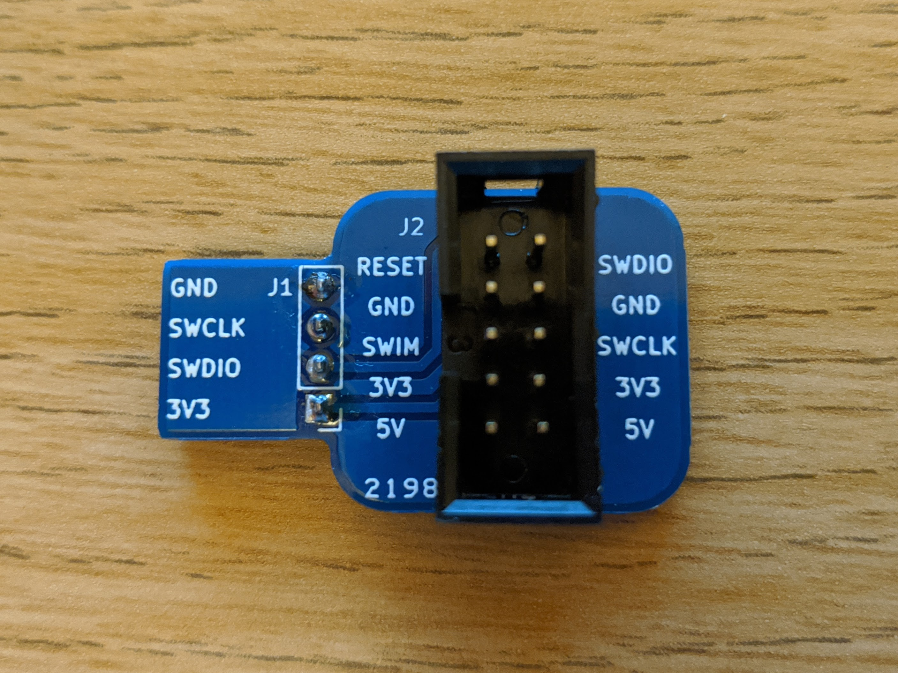
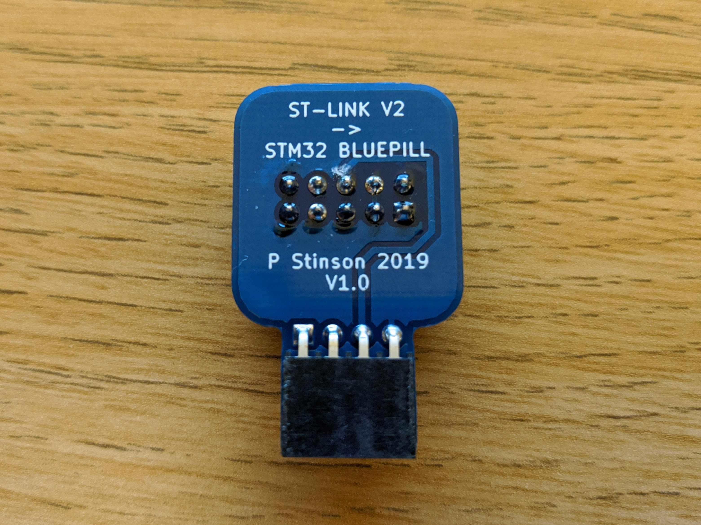

# Bluepill Programming Adaptor
Simple adaptor board to allow more convenient connection of an ST-LINK programmer to the "Bluepill" development board.

[![CC BY-SA 4.0][cc-by-sa-image]][cc-by-sa]

[cc-by-sa]: http://creativecommons.org/licenses/by-sa/4.0/
[cc-by-sa-image]: https://licensebuttons.net/l/by-sa/4.0/88x31.png
[cc-by-sa-shield]: https://img.shields.io/badge/License-CC%20BY--SA%204.0-lightgrey.svg

This work is licensed under a [Creative Commons Attribution-ShareAlike 4.0 International License][cc-by-sa].
